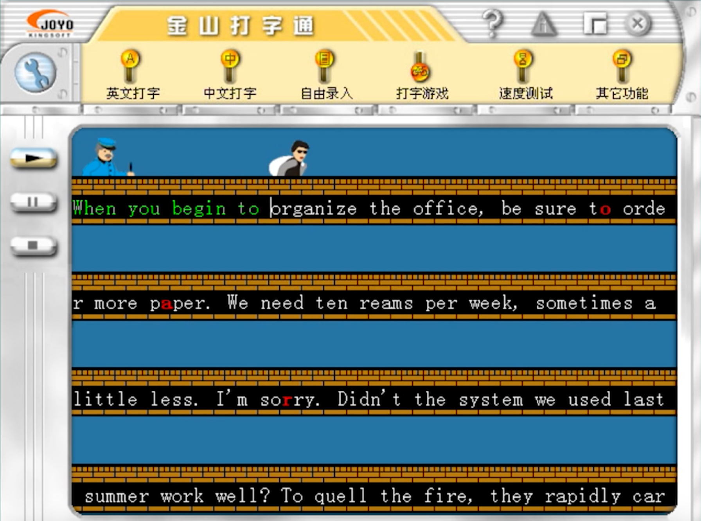
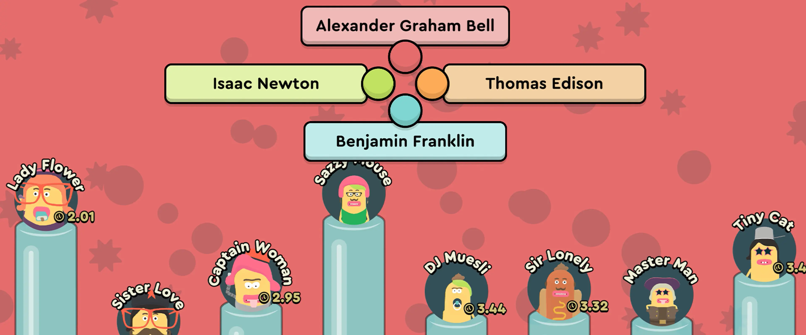

# Project Proposal
**The Idea: Learning through games**  
We want to create a web game to help students practice vocabulary. 
The target students are foreigners studying IELTS and wanted to take IELTS exams. 
We will be using previous IELTS-related materials such as IELTS must-learn vocabulary.  

**The Inspiration**  
The idea comes from an old typing practice game 
called _Catch Me If You Can (警察抓小偷)_ developed by Kingsoft (金山軟件). 
A screenshot of its 2000 version interface is available below. 
The previous mechanism is that your correct typing of the words and sentences 
will decide the forward pace of the thief, 
you will need to type the whole paraphrase fast and correctly 
to help the thief escape before the policeman behind caught him.

**The new mechanism**  
The new mechanism will be more complicated.  
1. At first, students will be asked to choose around 10-50 words 
in a list given (words in the list come from IELTS vocabulary). 
2. We will use AI to generate a reading material, 
whose function is similiar to the one in the picture - a path where the chase happens.
But some of the targeted words will be misspelled. 
3. Students will be given 1 minutes to read the material. Then the chase starts.
4. The police is still chasing the thief. The thief will be running at the beginning, 
and students are expected to correct those words otherwise he will stop. 
(Previously typing all the words, now only need to correct the misspelled ones)
5. If the students type it wrong, then the police will catch up and a _"fight"_ will be triggered. 
Example interface below:  

6. But this is a learning game not a real turn-based role play game, so instead of having weapons and complicated gameplay, the fight is more like a quiz taking the form of game. The student will be provided 4 options of the word meaning of the word mispelled, and they need to choose the right one before the police, otherwise lose one blood.
7. If they lose three blood, they will lose the game and the correct reading metariels and its translation will be given.

**Additional Notes**
1. Even if the students choose the exact same words at different times, the materials will be different too as AI will generate different outputs.

